# Solace - A Mental Health App for Students

## Introduction

Solace is a mental health application designed specifically for students. The platform provides personalized features based on the user's mood and helps students navigate their emotional well-being efficiently. It also offers a support system where students can interact with counselors and a community to share their experiences.

## Features

### Student Dashboard

Upon logging in, students are greeted with a pop-up asking, "How are you feeling today?" with options such as:

- Happy
- Sad
- Energetic
- Stable

Depending on their selected mood, they are presented with tailored features to enhance their experience. Alternatively, students can directly access their full dashboard.

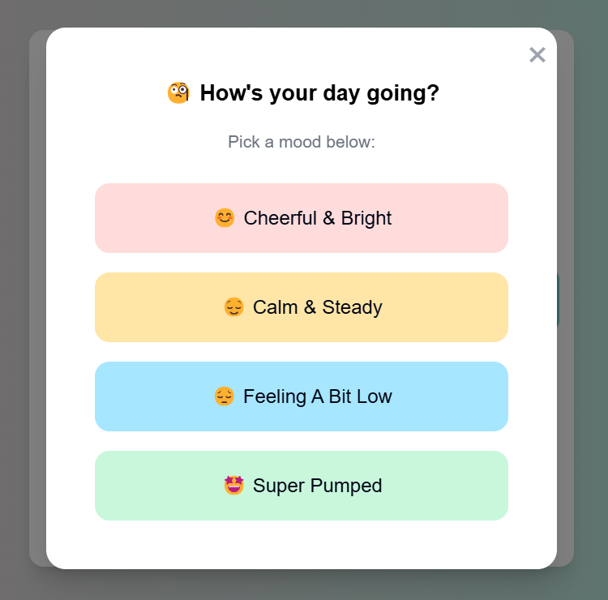

### Exam Harmony

- Students can sync their exam dates.
- The app provides pre-exam, exam day, and post-exam preparation messages.
- Helps in structured study planning and stress reduction.

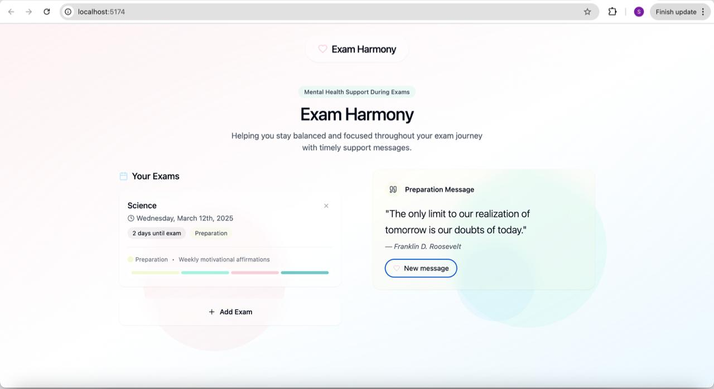

### Happy Mood Features

- **Gratitude Journal**: Students can write three things they were grateful for in their day.
  
  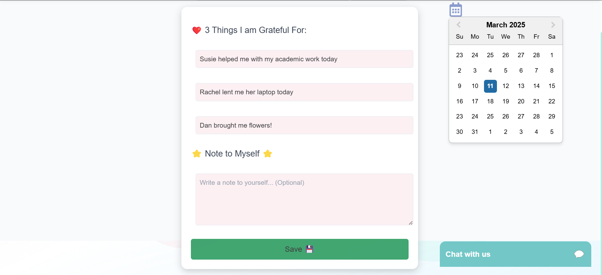
  
- **Gratitude Wall**: A digital space to add sticky notes, images, or other happy moments.
  
  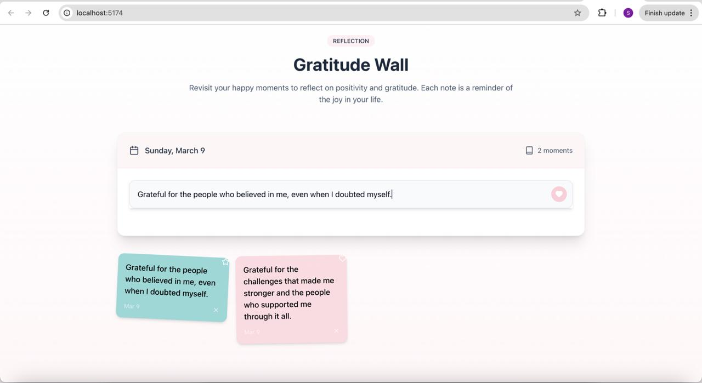
  
- **Feel Worthy Section**: Encourages students to acknowledge their small achievements, reducing comparison anxiety and boosting confidence.
  
  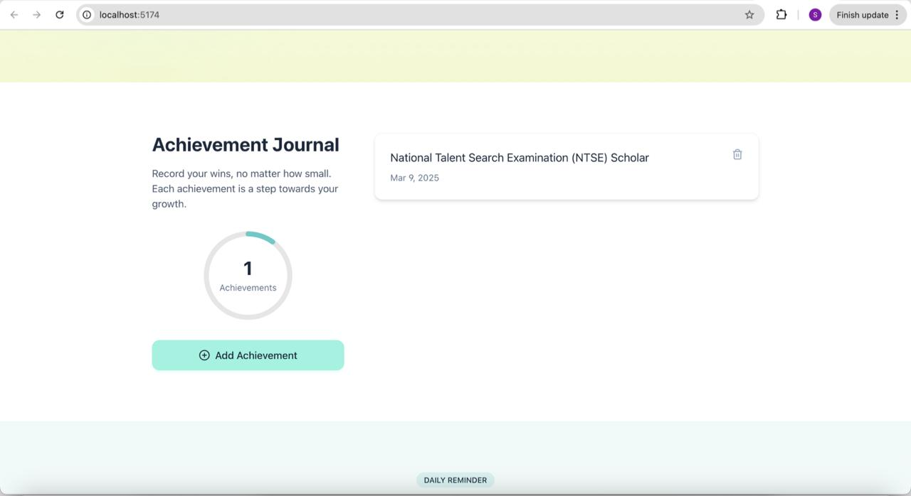

### Sad Mood Features

- **Community Chat**: Students can join discussions with peers facing similar challenges in the form of avatars, keeping their identity anonymous.
- **AI-Powered Chatbot**: Available 24/7 for mental health support.

  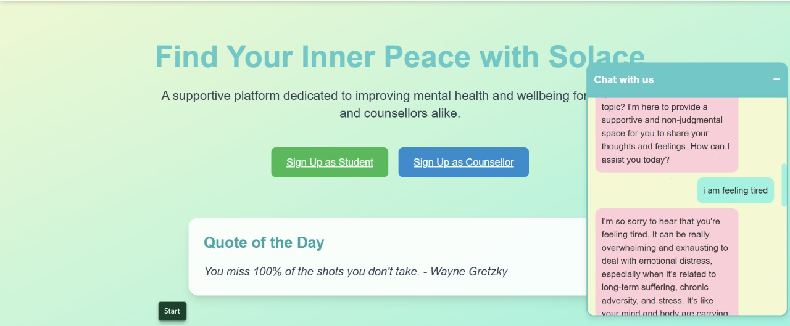
  
- **Counselor Support**: Students can book one-on-one or group counseling sessions.

  

    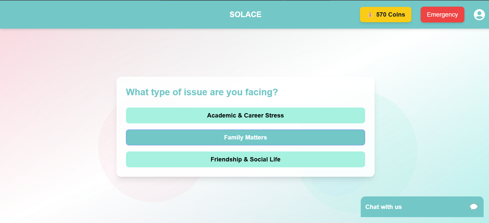
    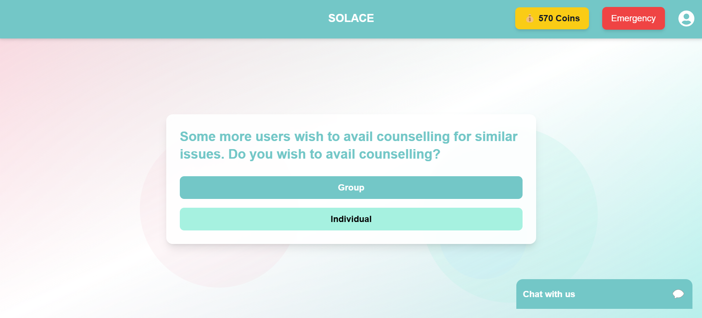
    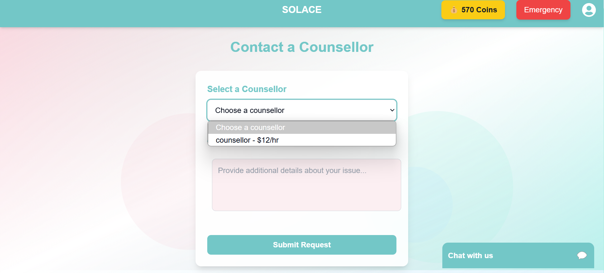
  

- **Let It Out**: A space for diary entries in text, audio, or video formats.
  
  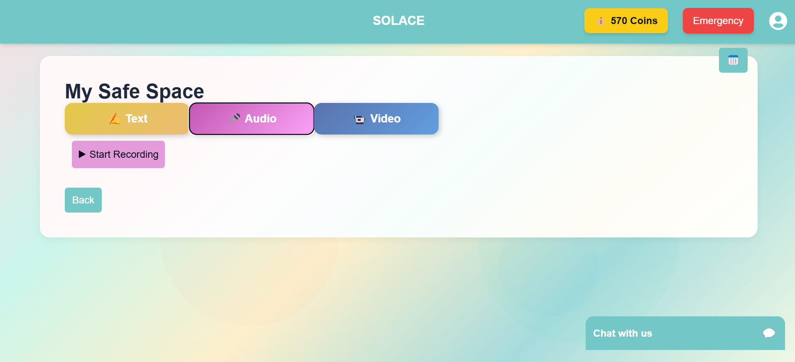
  
- **Guided Meditations**: Includes guided meditations, mindfulness exercises, etc.
  
  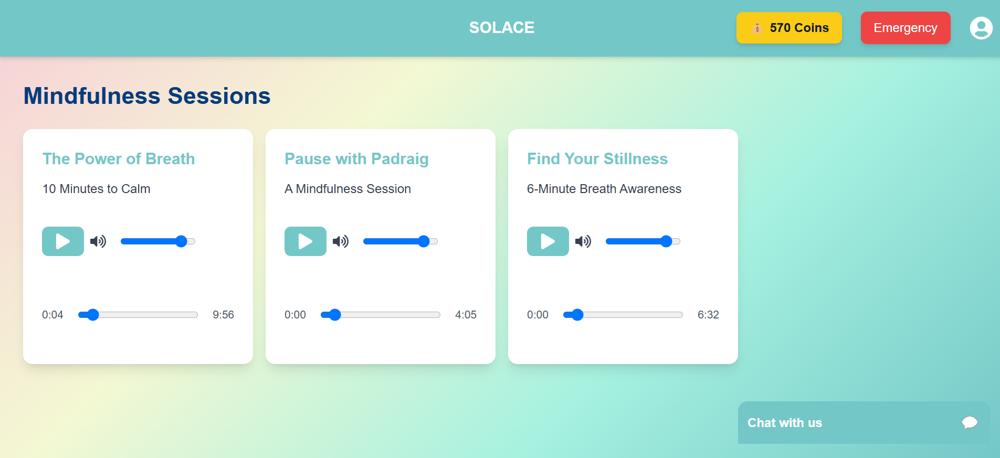
  
- **Curated Spaces**: Sleep music and curated spaces for introspection, with the facility of streaks.
  
  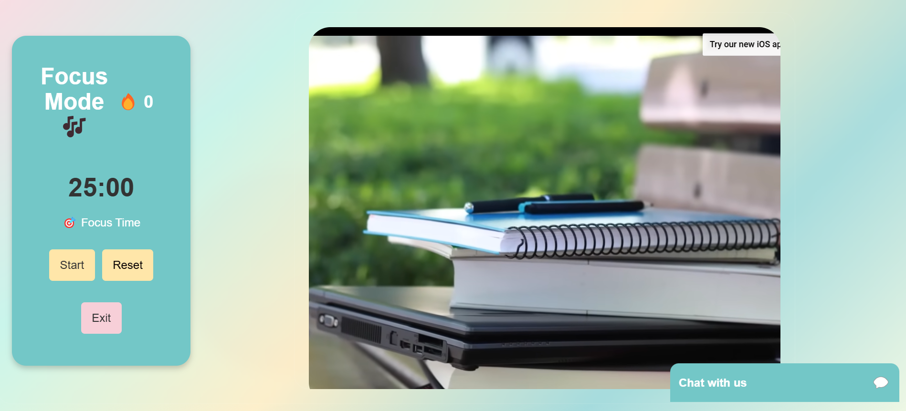

### Energetic Mood Features

- **Spin the Chore Wheel**: A fun way to complete daily chores. Students must complete and upload proof of five tasks, reducing procrastination.
  
  
  
- **Questionnaire**: A set of fun, situation-based, and mood-evaluating questions to assess the user's stress index. Identifies if the user is in a low or high-risk zone.
  
  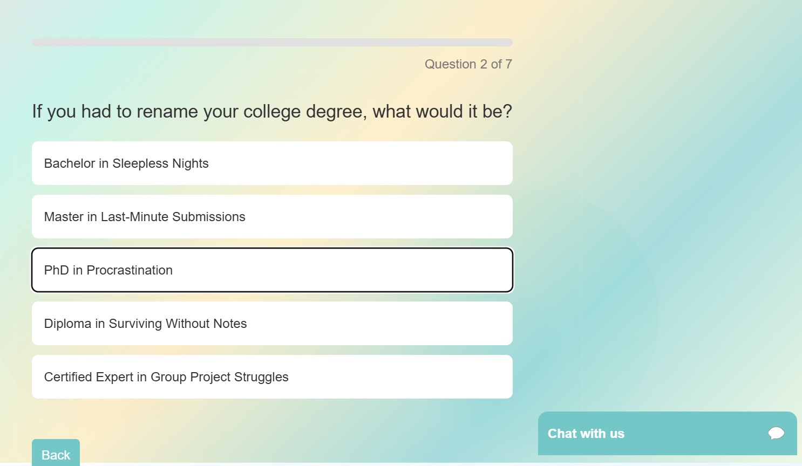

### Reward System

To increase user engagement, students earn coins upon completing tasks such as:

- Completing chores
- Answering questionnaires
- Writing gratitude journal entries
- Engaging in the "Let It Out" section

### Counselor Dashboard

- Accept or Decline Counseling Requests
- Schedule Meetings with students
- One-on-One Calls & Messaging

    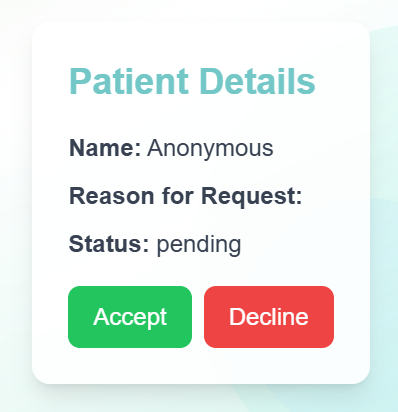
    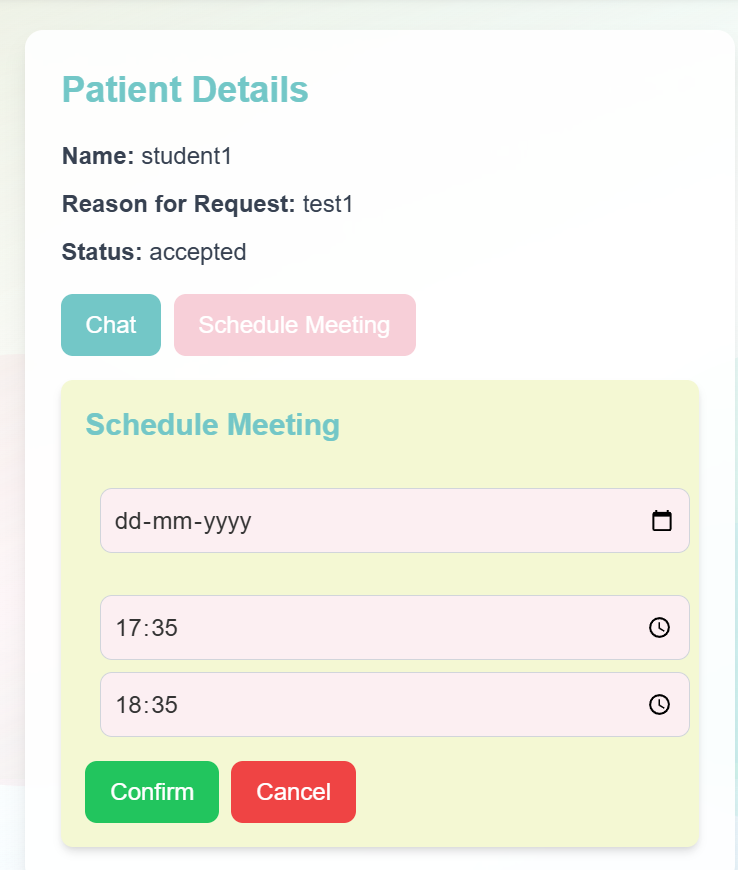
    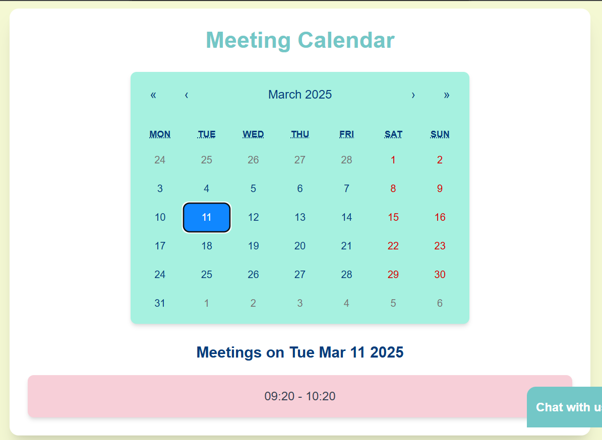
  

## Tech Stack

- **Frontend**: ReactJS
- **Backend**: Flask
- **Database & Authentication**: Firebase
- Website link: https://solace-q8l7n26nh-aasthas-projects-6f0b59b0.vercel.app/
  

## Future Plans

We plan to expand Solace with the following features:

- **Wearable Data Integration**: Syncing with wearable devices to track step count, heart rate, and sleep schedule, enabling a more personalized mental health experience.
- **Period Tracking**: A dedicated feature for female students to help them monitor their menstrual cycle and manage mood swings effectively.
- **AI-Based Engagement Analysis**: Using algorithms to analyze user engagement patterns and derive insights about their mental well-being.
- **Automated Exam Scheduling**: Instead of requiring students to manually enter exam schedules, Solace will sync with their school's curriculum for seamless scheduling.
- **Intelligent Gratitude & Achievement Recognition**: Automatically identifying user achievements and gratitude moments from their "Let It Out" entries, reducing the need for manual input and promoting self-appreciation.
